## **distribution-is-all-you-need**

**distribution-is-all-you-need** is the basic distribution probability tutorial for **most common distribution focused on Deep learning** using python library.

#### Overview of distribution probability

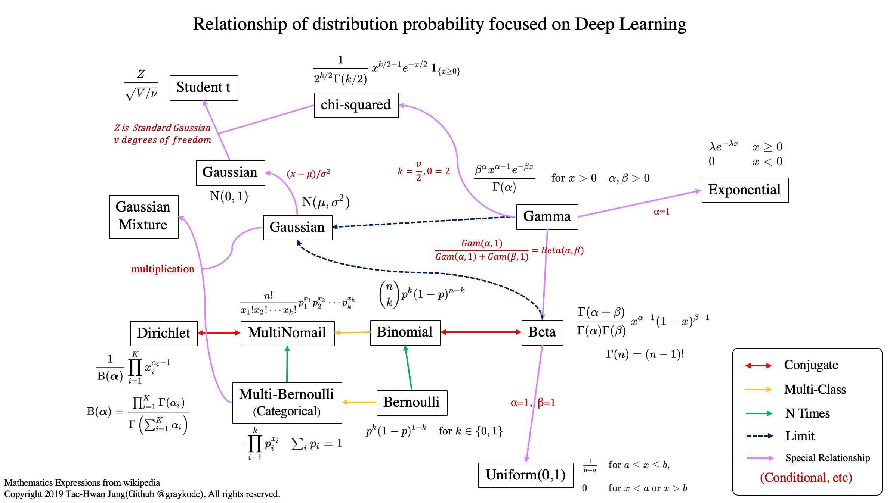

- `conjugate` means it has relationship of **conjugate distributions**.

  > In [Bayesian probability](https://en.wikipedia.org/wiki/Bayesian_probability) theory, if the [posterior distributions](https://en.wikipedia.org/wiki/Posterior_probability) *p*(*θ* | *x*) are in the same [probability distribution family](https://en.wikipedia.org/wiki/List_of_probability_distributions) as the [prior probability distribution](https://en.wikipedia.org/wiki/Prior_probability_distribution) *p*(θ), the prior and posterior are then called **conjugate distributions,** and the prior is called a **conjugate prior** for the [likelihood function](https://en.wikipedia.org/wiki/Likelihood_function).
  > [Conjugate prior, wikipedia](https://en.wikipedia.org/wiki/Conjugate_prior)
  
- `Multi-Class` means that Random Varivance are more than 2.

- `N Times` means that we also consider prior probability P(X). 

- If you would like to see the details about relationship of distribution probability, please refer to [this](https://en.wikipedia.org/wiki/Relationships_among_probability_distributions).

- To learn more about probability, I recommend reading [pattern recognition and machine learning, Bishop 2006].

## distribution probabilities and features

1. Uniform distribution(continuous) [code](uniform.py)
   - Uniform distribution has same probaility value on [a, b], easy probability.

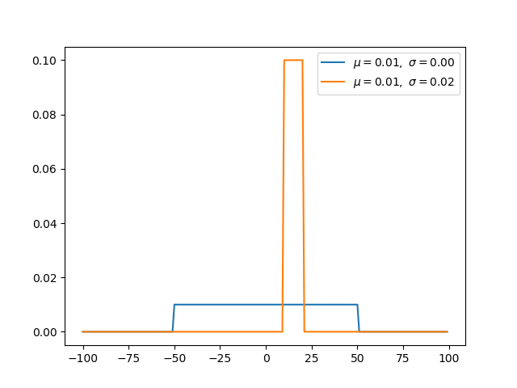

2. Bernoulli distribution(discrete) [code](bernoulli.py)
- Bernoulli distribution is not considered about prior probability P(X). Therefore, if we optimize to the maximum likelihood, we will be vulnerable to overfitting.
  
- We use **binary cross entropy** to classify binary classification. It is like taking a negative log of the bernoulli distribution.

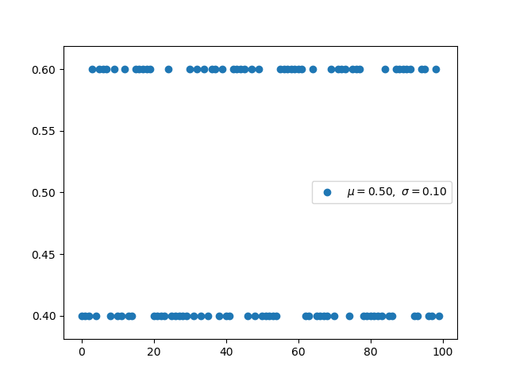

3. Binomial distribution(discrete) [code](binomial.py)
   - Binomial distribution with parameters n and p is the discrete probability distribution of the number of successes in a sequence of n independent experiments.
   
   - Binomial distribution is distribution considered prior probaility by specifying the number to be picked in advance.
   

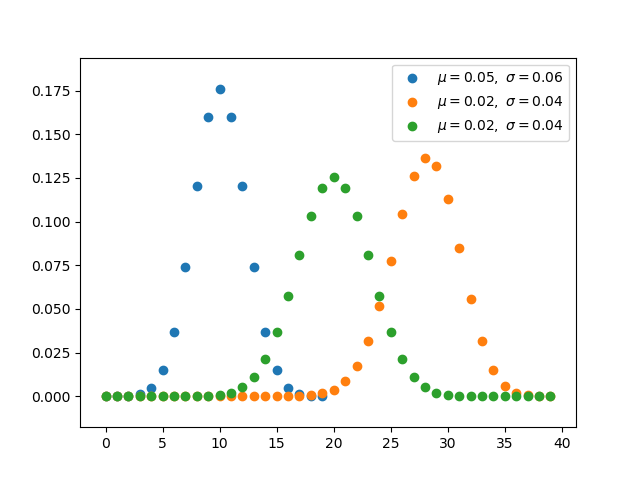

4. Multi-Bernoulli distribution, Categorical distribution(discrete) [code](categorical.py)
   - Multi-bernoulli called categorical distribution, is a probability expanded more than 2.

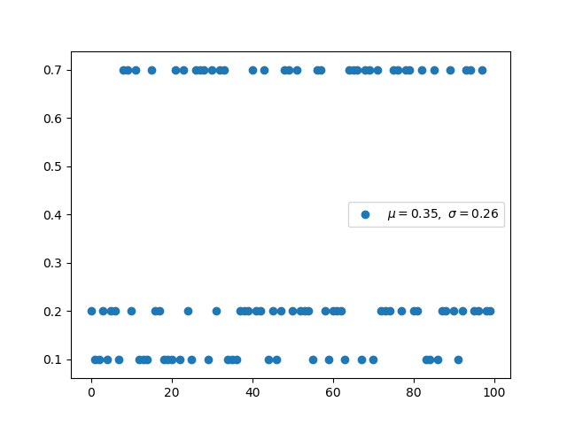

5. Multinomial distribution(discrete), [code](multinomial.py)

   - The multinomial distribution has the same relationship with the categorical distribution as the relationship between Bernoull and Binomial.

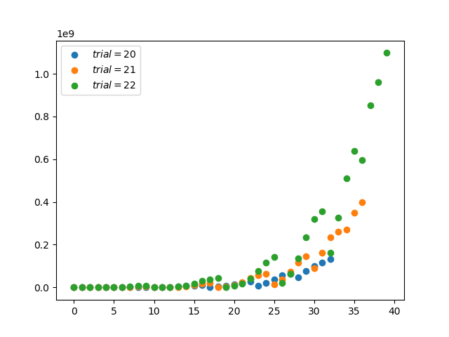

6. Beta distribution(continuous), [code](beta.py)
  
   - Beta distribution is conjugate to the binomial and Bernoulli distributions.
   - Using conjucation, we can get the posterior distribution more easily using the prior distribution we know.
   - Uniform distiribution is same when beta distribution met special case(alpha=1, beta=1).
   

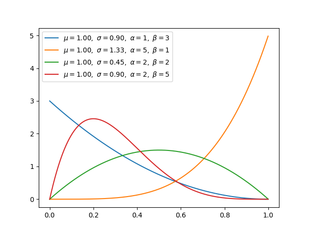

7. Dirichlet distribution(continuous), [code](dirichlet.py)

   - Dirichlet distribution is conjugate to the MultiNomial distributions.

   - If k=2, it will be Beta distribution.

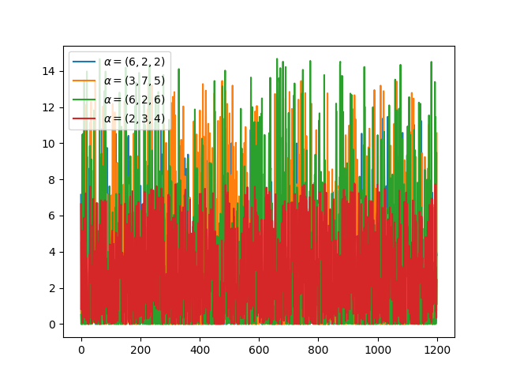

8. Gamma distribution(continuous), [code](gamma.py)

   - Gamma distribution will be beta distribution, if `Gamma(a,1) / Gamma(a,1) + Gamma(b,1)` is same with `Beta(a,b)`.

   - The exponential distribution and chi-squared distribution are special cases of the gamma distribution.

9. Exponential distribution(continuous), [code](exponential.py)

   - Exponential distribution is special cases of the gamma distribution when alpha is 1.

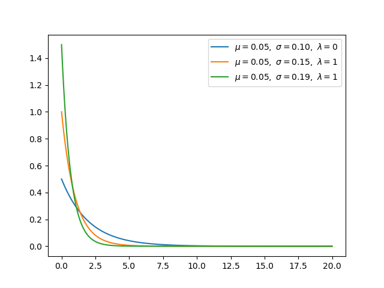

10. Gaussian distribution(continuous), [code](gaussian.py)

    - Gaussian distribution is a very common continuous probability distribution

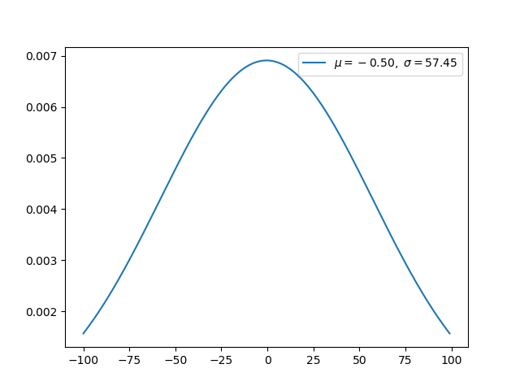

11. Normal distribution(continuous), [code](normal.py)

    - Normal distribution is standarzed Gaussian distribution, it has 0 mean and 1 std.

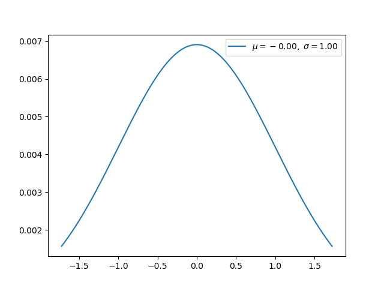

